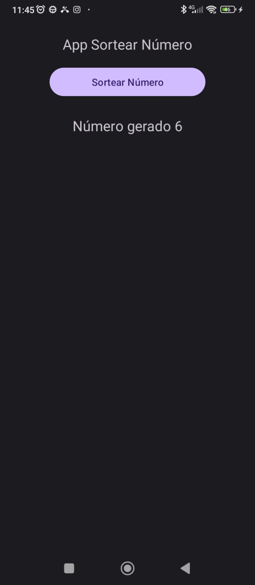

# Curso Android Jamilton Damasceno
Esse é um curso completo tem mais de 68 horas de vídeos

Sobre o Curso:

Layouts: XML, temas, constraint layout, toolbar, menus, linear layout,  interface Netflix

Java: variáveis, condicionais, loops, classes e objetos e mais

Kotlin: variáveis, tipos, arrays, Funções, classes e objetos, herança, modificadores de acesso, companion, enum, lateinit, interface, App Gasolina ou Álcool e mais

Coleções: listas, set, map, filter, map, union, order

Interface: TextInputLayout, Button, ImageView, AlertDialog, FloatingActionButton, Checkbox, Snackbar, Spinner e outros

Listagem: ListView, RecyclerView, CardView

Jetpack: Extensões KTX e ViewBinding

Navegação: activities, fragments

Banco de Dados: INSERT, UPDATE, DELETE, UPDATE, SELECT, PRIMARY KEY, LIKE, WHERE e muito mais!

Dados: preferências, CRUD banco de dados SQLite no Android

API com Retrofit: threads, coroutine, requisições: GET, PUT, PATCH e DELETE, Picasso

Firebase: autenticação, Banco de dados Firestore, filtros, Armazenamento com Storage, upload de imagem. múltiplas permissões, regras firebase

WhatsApp: cadastro e autenticação, navegação por abas, toolbar customizada, edição de perfil, envio de mensagens, exibição de conversas e muito mais

Link do curso: https://www.udemy.com/course/desenvolvimento-android-completo/

1 - App

Um app para sortear números aleatórios

